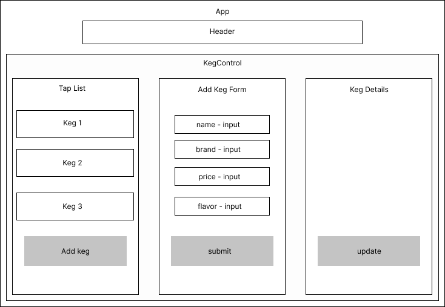

# Kombucha Taproom

## By _Brenna Lavin_

### This taproom inventory management project is a practice in using React fundamentals

## App Diagram



## Technologies Used

* React
* JavaScript

## Description

Using React and JavaScript, this project is a practice in state management using keg inventory for a faux Kombucha taproom

## Setup/Installation Requirements

* Clone this repository to your local machine.
* In the project's root folder, type ```npm install``` in your terminal to install the project's dependencies.
* Next type ```npm start``` in your terminal to start the program, it will open the project at [http://localhost:3000](http://localhost:3000), and you will be able to view in your browser.
* To end the program, type ```CMD+C``` on MacOs or ```Windows+C``` on PC in your terminal.

## Known Bugs

* None

## License

MIT License

Copyright (c) [2022] [Brenna Lavin](https://github.com/lavinbrenna)

Permission is hereby granted, free of charge, to any person obtaining a copy
of this software and associated documentation files (the "Software"), to deal
in the Software without restriction, including without limitation the rights
to use, copy, modify, merge, publish, distribute, sublicense, and/or sell
copies of the Software, and to permit persons to whom the Software is
furnished to do so, subject to the following conditions:

The above copyright notice and this permission notice shall be included in all
copies or substantial portions of the Software.

THE SOFTWARE IS PROVIDED "AS IS", WITHOUT WARRANTY OF ANY KIND, EXPRESS OR
IMPLIED, INCLUDING BUT NOT LIMITED TO THE WARRANTIES OF MERCHANTABILITY,
FITNESS FOR A PARTICULAR PURPOSE AND NONINFRINGEMENT. IN NO EVENT SHALL THE
AUTHORS OR COPYRIGHT HOLDERS BE LIABLE FOR ANY CLAIM, DAMAGES OR OTHER
LIABILITY, WHETHER IN AN ACTION OF CONTRACT, TORT OR OTHERWISE, ARISING FROM,
OUT OF OR IN CONNECTION WITH THE SOFTWARE OR THE USE OR OTHER DEALINGS IN THE
SOFTWARE.
